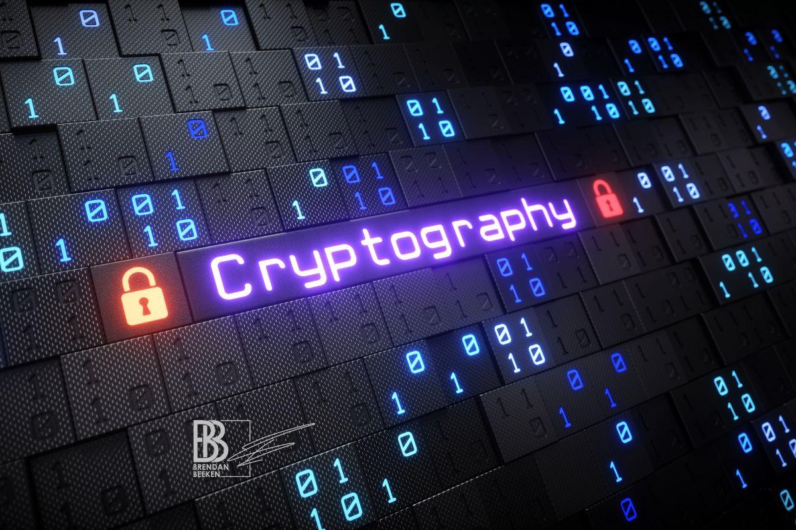

# 🔐 Multi Cipher Encryption Tool

A web-based **encryption and decryption tool** built using **HTML, CSS, and JavaScript** that allows users to experiment with multiple cryptographic algorithms such as Caesar Cipher, Substitution Cipher, DES, AES, and SHA-1.

---

## 🌟 Features

- 🔸 **User-friendly Interface** – Simple, clean, and responsive design.
- 🔸 **Multiple Algorithms Supported**
  - Caesar Cipher
  - Substitution Cipher
  - DES
  - AES
  - SHA-1 Hash
- 🔸 **Real-time Encryption/Decryption**
- 🔸 **Customizable Background and Theming**
- 🔸 **Cyan-blue futuristic styling**
- 🔸 **Secure and lightweight frontend tool**

---

## 🧠 Technologies Used

| Technology | Purpose |
|-------------|----------|
| **HTML5** | Structure of the webpage |
| **CSS3** | Styling and layout |
| **JavaScript (ES6)** | Core logic for encryption/decryption |

---

## 🖼️ Preview



*(Background image used in the project interface)*

---

## ⚙️ How to Run Locally

1. **Clone the Repository**
   ```bash
   git clone https://github.com/<sahithigundu17>/multi-cipher-encryption.git
2. **Open the Project**
   ```bash
   cd multi-cipher-encryption
3. **Run Project**
   Open Index.html in browser
4. 📁 **Folder Structure**

   multi-cipher-encryption/
      
    ├── index.html 
    
    ├── style.css 
    
    ├── script.js
    
    ├── image.jpg        
